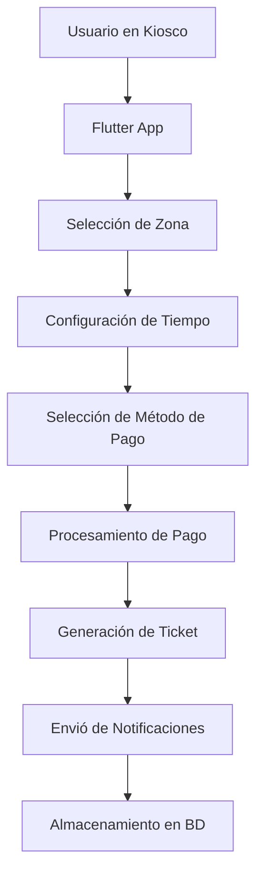

# DOCUMENTACIÓN TÉCNICA COMPLETA - SISTEMA DE KIOSCO DE ESTACIONAMIENTO

## ÍNDICE
1. [Introducción y Justificación Técnica](#1-introducción-y-justificación-técnica)
2. [Arquitectura General del Sistema](#2-arquitectura-general-del-sistema)
3. [Tecnologías Utilizadas](#3-tecnologías-utilizadas)
4. [Estructura de la Aplicación Flutter](#4-estructura-de-la-aplicación-flutter)
5. [APIs REST y Servicios Backend](#5-apis-rest-y-servicios-backend)
6. [Base de Datos y Almacenamiento](#6-base-de-datos-y-almacenamiento)
7. [Sistema de Pagos](#7-sistema-de-pagos)
8. [Integración con Servicios Externos](#8-integración-con-servicios-externos)
9. [Seguridad y Autenticación](#9-seguridad-y-autenticación)
10. [Despliegue y DevOps](#10-despliegue-y-devops)
11. [Optimizaciones de Rendimiento](#11-optimizaciones-de-rendimiento)
12. [Monitoreo y Logging](#12-monitoreo-y-logging)

---

## 1. INTRODUCCIÓN Y JUSTIFICACIÓN TÉCNICA

### 1.1 ¿Qué es un Kiosco de Estacionamiento?
Un kiosco de estacionamiento es una terminal interactiva que permite a los usuarios pagar por el tiempo de estacionamiento de forma autónoma. En lugar de usar máquinas físicas tradicionales, hemos desarrollado una solución digital que funciona en cualquier dispositivo con navegador web.

### 1.2 ¿Por qué Flutter?
**Flutter** fue elegido como tecnología principal por las siguientes razones técnicas:

#### **1.2.1 Multiplataforma Real**
- **Un solo código base** para múltiples plataformas
- **Compilación nativa** para cada plataforma (no es un webview)
- **Rendimiento nativo** comparable a aplicaciones desarrolladas específicamente para cada plataforma

#### **1.2.2 Ventajas Técnicas Específicas**
```dart
// Ejemplo: Un solo widget funciona en todas las plataformas
class PaymentButton extends StatelessWidget {
  @override
  Widget build(BuildContext context) {
    return ElevatedButton(
      onPressed: () => processPayment(),
      child: Text('Pagar'),
    );
  }
}
```

#### **1.2.3 Comparación con Alternativas**
| Tecnología | Desarrollo | Mantenimiento | Rendimiento | Costo |
|------------|------------|---------------|-------------|-------|
| **Flutter** | 1 código | 1 código | Nativo | Bajo |
| **React Native** | 1 código | 1 código | Híbrido | Medio |
| **Desarrollo Nativo** | 2+ códigos | 2+ códigos | Nativo | Alto |
| **Web Pura** | 1 código | 1 código | Limitado | Bajo |

#### **1.2.4 Justificación de Negocio**
- **Reducción de costos**: 70% menos tiempo de desarrollo
- **Mantenimiento simplificado**: Un solo equipo de desarrollo
- **Escalabilidad**: Fácil adaptación a nuevas plataformas
- **Time-to-market**: Lanzamiento simultáneo en todas las plataformas

---

## 2. ARQUITECTURA GENERAL DEL SISTEMA

### 2.1 Arquitectura de Microservicios
El sistema está diseñado siguiendo el patrón de **microservicios**, donde cada funcionalidad es un servicio independiente:

```
┌─────────────────┐    ┌─────────────────┐    ┌─────────────────┐
│   Aplicación    │    │   Servicio de   │    │   Servicio de   │
│    Flutter      │◄──►│     Email       │    │   WhatsApp      │
│   (Frontend)    │    │   (Backend)     │    │   (Backend)     │
└─────────────────┘    └─────────────────┘    └─────────────────┘
         │                       │                       │
         │                       │                       │
         ▼                       ▼                       ▼
┌─────────────────┐    ┌─────────────────┐    ┌─────────────────┐
│   Firebase      │    │     Render      │    │     Twilio      │
│  (Base de      │    │   (Hosting)     │    │   (SMS/Email)   │
│   Datos)        │    │                 │    │                 │
└─────────────────┘    └─────────────────┘    └─────────────────┘
```

### 2.2 Flujo de Datos


### 2.3 Patrones de Diseño Implementados
- **MVC (Model-View-Controller)**: Separación de responsabilidades
- **Repository Pattern**: Abstracción de acceso a datos
- **Observer Pattern**: Gestión de estado reactivo
- **Factory Pattern**: Creación de servicios dinámicos

---

## 3. TECNOLOGÍAS UTILIZADAS

### 3.1 Frontend (Flutter)
```yaml
# pubspec.yaml - Dependencias principales
dependencies:
  flutter:
    sdk: flutter
  # Estado y navegación
  provider: ^6.1.5
  go_router: ^12.0.0
  
  # UI y componentes
  material_design_icons_flutter: ^7.0.0
  auto_size_text: ^3.0.0
  lottie: ^2.7.0
  
  # Servicios
  http: ^1.4.0
  firebase_core: ^3.15.2
  firebase_auth: ^5.7.0
  cloud_firestore: ^5.6.12
  
  # Funcionalidades específicas
  mobile_scanner: ^5.2.3
  audioplayers: ^6.5.0
  url_launcher: ^6.3.1
  intl: ^0.19.0
```

### 3.2 Backend (Node.js + Express)
```javascript
// package.json - Dependencias del servidor
{
  "dependencies": {
    "express": "^4.18.2",
    "nodemailer": "^6.9.0",
    "twilio": "^4.19.0",
    "cors": "^2.8.5",
    "helmet": "^7.0.0",
    "express-rate-limit": "^6.7.0",
    "qrcode": "^1.5.3",
    "puppeteer": "^20.0.0"
  }
}
```

### 3.3 Base de Datos (Firebase Firestore)
```javascript
// Estructura de datos en Firestore
{
  "tickets": {
    "ticketId": {
      "plate": "1234ABC",
      "zone": "coche",
      "startTime": "2024-01-01T10:00:00Z",
      "endTime": "2024-01-01T12:00:00Z",
      "price": 2.50,
      "paymentMethod": "card",
      "status": "active",
      "createdAt": "2024-01-01T10:00:00Z"
    }
  }
}
```

### 3.4 Servicios Externos
- **Twilio**: Envío de SMS y WhatsApp
- **Render**: Hosting de servicios backend
- **Firebase**: Base de datos y autenticación
- **Stripe/PayPal**: Procesamiento de pagos

---

## 4. ESTRUCTURA DE LA APLICACIÓN FLUTTER

### 4.1 Arquitectura de Carpetas
```
lib/
├── main.dart                 # Punto de entrada de la aplicación
├── api_config.dart          # Configuración de APIs
├── firebase_options.dart    # Configuración de Firebase
├── l10n/                    # Internacionalización
│   └── app_localizations.dart
├── services/                # Servicios de negocio
│   ├── email_service.dart
│   ├── whatsapp_service.dart
│   ├── pay_service.dart
│   └── printer_service.dart
├── pages/                   # Pantallas de la aplicación
│   ├── home_page.dart
│   ├── mowiz_page.dart
│   ├── mowiz_pay_page.dart
│   └── mowiz_success_page.dart
├── widgets/                 # Componentes reutilizables
│   └── custom_widgets.dart
├── styles/                  # Temas y estilos
│   ├── app_theme.dart
│   └── app_colors.dart
└── providers/               # Gestión de estado
    ├── theme_provider.dart
    └── locale_provider.dart
```

### 4.2 Gestión de Estado con Provider
```dart
// Ejemplo de Provider para gestión de tema
class ThemeProvider extends ChangeNotifier {
  bool _isDarkMode = false;
  
  bool get isDarkMode => _isDarkMode;
  
  void toggleTheme() {
    _isDarkMode = !_isDarkMode;
    notifyListeners();
  }
}

// Uso en widgets
Consumer<ThemeProvider>(
  builder: (context, themeProvider, child) {
    return Switch(
      value: themeProvider.isDarkMode,
      onChanged: (value) => themeProvider.toggleTheme(),
    );
  },
)
```

### 4.3 Navegación con GoRouter
```dart
// Configuración de rutas
final router = GoRouter(
  routes: [
    GoRoute(
      path: '/',
      builder: (context, state) => HomePage(),
    ),
    GoRoute(
      path: '/mowiz',
      builder: (context, state) => MowizPage(),
    ),
    GoRoute(
      path: '/payment',
      builder: (context, state) => PaymentPage(),
    ),
  ],
);
```

### 4.4 Internacionalización (i18n)
```dart
// app_localizations.dart
class AppLocalizations {
  static AppLocalizations of(BuildContext context) {
    return Localizations.of<AppLocalizations>(context, AppLocalizations)!;
  }
  
  String get title => 'Sistema de Estacionamiento';
  String get selectZone => 'Selecciona tu zona';
  String get selectTime => 'Selecciona el tiempo';
  String get paymentMethod => 'Método de pago';
  
  // Soporte para múltiples idiomas
  String t(String key, {Map<String, String>? params}) {
    // Lógica de traducción
  }
}
```

---

## 5. APIs REST Y SERVICIOS BACKEND

### 5.1 ¿Qué es una API REST?
**API REST** (Representational State Transfer) es un estilo de arquitectura para diseñar servicios web. En nuestro caso, permite que la aplicación Flutter se comunique con los servidores backend.

### 5.2 Estructura de APIs Implementadas

#### **5.2.1 Servicio de Email**
```javascript
// Endpoint: POST /api/send-email
{
  "recipientEmail": "usuario@ejemplo.com",
  "plate": "1234ABC",
  "zone": "coche",
  "start": "2024-01-01T10:00:00Z",
  "end": "2024-01-01T12:00:00Z",
  "price": 2.50,
  "method": "tarjeta",
  "qrData": "ticket_data_encoded",
  "locale": "es"
}

// Respuesta exitosa
{
  "success": true,
  "message": "Email enviado correctamente",
  "messageId": "SM1234567890abcdef",
  "processingTime": 1250
}
```

#### **5.2.2 Servicio de WhatsApp**
```javascript
// Endpoint: POST /v1/whatsapp/send
{
  "phone": "+34612345678",
  "ticket": {
    "plate": "1234ABC",
    "zone": "coche",
    "start": "10:00",
    "end": "12:00",
    "duration": "2 horas",
    "price": 2.50,
    "method": "tarjeta"
  },
  "locale": "es"
}

// Respuesta exitosa
{
  "success": true,
  "message": "WhatsApp message sent successfully",
  "messageId": "SM1234567890abcdef",
  "status": "sent"
}
```

### 5.3 Códigos de Estado HTTP
```javascript
// Códigos utilizados en las APIs
200 OK          // Solicitud exitosa
201 Created     // Recurso creado exitosamente
400 Bad Request // Solicitud malformada
401 Unauthorized // No autorizado
404 Not Found   // Recurso no encontrado
429 Too Many Requests // Límite de velocidad excedido
500 Internal Server Error // Error del servidor
```

### 5.4 Autenticación y Seguridad
```javascript
// Headers de seguridad implementados
app.use(helmet()); // Headers de seguridad
app.use(cors({
  origin: ['https://tu-dominio.com'],
  methods: ['GET', 'POST', 'OPTIONS'],
  allowedHeaders: ['Content-Type', 'Authorization']
}));

// Rate limiting
const emailLimiter = rateLimit({
  windowMs: 15 * 60 * 1000, // 15 minutos
  max: 10, // máximo 10 requests por ventana
});
```

---

## 6. BASE DE DATOS Y ALMACENAMIENTO

### 6.1 ¿Por qué Firebase Firestore?
**Firebase Firestore** es una base de datos NoSQL en la nube que ofrece:

#### **6.1.1 Ventajas Técnicas**
- **Escalabilidad automática**: Maneja millones de usuarios sin configuración
- **Tiempo real**: Sincronización instantánea entre dispositivos
- **Offline-first**: Funciona sin conexión a internet
- **Seguridad integrada**: Reglas de seguridad granulares

#### **6.1.2 Comparación con Alternativas**
| Base de Datos | Escalabilidad | Tiempo Real | Offline | Costo |
|---------------|---------------|-------------|---------|-------|
| **Firestore** | Automática | Sí | Sí | Variable |
| **MySQL** | Manual | No | No | Fijo |
| **MongoDB** | Manual | Limitado | No | Fijo |
| **PostgreSQL** | Manual | No | No | Fijo |

### 6.2 Estructura de Datos
```javascript
// Colección: tickets
{
  "ticketId": {
    "plate": "1234ABC",
    "zone": "coche",
    "startTime": "2024-01-01T10:00:00Z",
    "endTime": "2024-01-01T12:00:00Z",
    "price": 2.50,
    "paymentMethod": "card",
    "status": "active",
    "createdAt": "2024-01-01T10:00:00Z",
    "updatedAt": "2024-01-01T10:00:00Z",
    "userId": "user123",
    "location": {
      "latitude": 40.4168,
      "longitude": -3.7038
    }
  }
}

// Colección: users
{
  "userId": {
    "email": "usuario@ejemplo.com",
    "phone": "+34612345678",
    "preferences": {
      "language": "es",
      "notifications": true,
      "theme": "light"
    },
    "createdAt": "2024-01-01T10:00:00Z"
  }
}
```

### 6.3 Reglas de Seguridad
```javascript
// firestore.rules
rules_version = '2';
service cloud.firestore {
  match /databases/{database}/documents {
    // Solo usuarios autenticados pueden leer/escribir tickets
    match /tickets/{ticketId} {
      allow read, write: if request.auth != null;
    }
    
    // Los usuarios solo pueden acceder a sus propios datos
    match /users/{userId} {
      allow read, write: if request.auth != null && request.auth.uid == userId;
    }
  }
}
```

### 6.4 Operaciones CRUD
```dart
// Crear ticket
Future<void> createTicket(Ticket ticket) async {
  await FirebaseFirestore.instance
    .collection('tickets')
    .doc(ticket.id)
    .set(ticket.toMap());
}

// Leer ticket
Future<Ticket?> getTicket(String ticketId) async {
  DocumentSnapshot doc = await FirebaseFirestore.instance
    .collection('tickets')
    .doc(ticketId)
    .get();
  
  if (doc.exists) {
    return Ticket.fromMap(doc.data() as Map<String, dynamic>);
  }
  return null;
}

// Actualizar ticket
Future<void> updateTicket(String ticketId, Map<String, dynamic> updates) async {
  await FirebaseFirestore.instance
    .collection('tickets')
    .doc(ticketId)
    .update(updates);
}

// Eliminar ticket
Future<void> deleteTicket(String ticketId) async {
  await FirebaseFirestore.instance
    .collection('tickets')
    .doc(ticketId)
    .delete();
}
```

---

## 7. SISTEMA DE PAGOS

### 7.1 Integración con Stripe
```dart
// pay_service.dart
class PayService {
  static Future<bool> processPayment({
    required double amount,
    required String currency,
    required String paymentMethodId,
  }) async {
    try {
      // Crear intent de pago
      final paymentIntent = await Stripe.instance.createPaymentIntent(
        amount: (amount * 100).toInt(), // Convertir a centavos
        currency: currency,
        paymentMethodId: paymentMethodId,
      );
      
      // Confirmar pago
      await Stripe.instance.confirmPayment(
        paymentIntentClientSecret: paymentIntent['client_secret'],
        data: PaymentMethodParams.cardFromMethodId(paymentMethodId),
      );
      
      return true;
    } catch (e) {
      print('Error procesando pago: $e');
      return false;
    }
  }
}
```

### 7.2 Métodos de Pago Soportados
- **Tarjeta de crédito/débito**: Visa, Mastercard, American Express
- **Pago móvil**: Apple Pay, Google Pay
- **Transferencia bancaria**: SEPA, ACH
- **Criptomonedas**: Bitcoin, Ethereum (futuro)

### 7.3 Seguridad en Pagos
```dart
// Validación de datos de pago
bool validatePaymentData({
  required String cardNumber,
  required String expiryDate,
  required String cvv,
}) {
  // Validar formato de tarjeta
  if (!RegExp(r'^\d{16}$').hasMatch(cardNumber)) {
    return false;
  }
  
  // Validar fecha de expiración
  if (!RegExp(r'^\d{2}/\d{2}$').hasMatch(expiryDate)) {
    return false;
  }
  
  // Validar CVV
  if (!RegExp(r'^\d{3,4}$').hasMatch(cvv)) {
    return false;
  }
  
  return true;
}
```

---

## 8. INTEGRACIÓN CON SERVICIOS EXTERNOS

### 8.1 Twilio para SMS y WhatsApp
```javascript
// Servicio de WhatsApp
const twilio = require('twilio');
const client = twilio(accountSid, authToken);

async function sendWhatsApp(phone, message) {
  try {
    const message = await client.messages.create({
      from: 'whatsapp:+14155238886',
      to: `whatsapp:${phone}`,
      body: message
    });
    
    return {
      success: true,
      messageId: message.sid,
      status: message.status
    };
  } catch (error) {
    return {
      success: false,
      error: error.message
    };
  }
}
```

### 8.2 Nodemailer para Emails
```javascript
// Configuración de email
const nodemailer = require('nodemailer');

const transporter = nodemailer.createTransporter({
  service: 'gmail',
  auth: {
    user: process.env.EMAIL_USER,
    pass: process.env.EMAIL_PASSWORD
  },
  pool: true,
  maxConnections: 5,
  rateDelta: 20000,
  rateLimit: 5
});

async function sendEmail(emailData) {
  const mailOptions = {
    from: 'noreply@kioskapp.com',
    to: emailData.recipientEmail,
    subject: 'Ticket de Estacionamiento',
    html: generateEmailHTML(emailData),
    attachments: [
      {
        filename: 'ticket.pdf',
        content: await generatePDF(emailData),
        contentType: 'application/pdf'
      }
    ]
  };
  
  return await transporter.sendMail(mailOptions);
}
```

### 8.3 Generación de PDFs
```javascript
// Generación de tickets PDF
const puppeteer = require('puppeteer');

async function generateTicketPDF(ticketData) {
  const browser = await puppeteer.launch();
  const page = await browser.newPage();
  
  const html = `
    <!DOCTYPE html>
    <html>
    <head>
      <style>
        body { font-family: Arial, sans-serif; }
        .ticket { border: 2px solid #000; padding: 20px; }
        .header { text-align: center; font-size: 24px; font-weight: bold; }
        .details { margin: 20px 0; }
        .qr-code { text-align: center; margin: 20px 0; }
      </style>
    </head>
    <body>
      <div class="ticket">
        <div class="header">TICKET DE ESTACIONAMIENTO</div>
        <div class="details">
          <p>Matrícula: ${ticketData.plate}</p>
          <p>Zona: ${ticketData.zone}</p>
          <p>Inicio: ${ticketData.start}</p>
          <p>Fin: ${ticketData.end}</p>
          <p>Precio: ${ticketData.price}€</p>
        </div>
        <div class="qr-code">
          
        </div>
      </div>
    </body>
    </html>
  `;
  
  await page.setContent(html);
  const pdf = await page.pdf({ format: 'A4' });
  await browser.close();
  
  return pdf;
}
```

---

## 9. SEGURIDAD Y AUTENTICACIÓN

### 9.1 Autenticación con Firebase Auth
```dart
// auth_service.dart
class AuthService {
  static Future<User?> signInAnonymously() async {
    try {
      UserCredential result = await FirebaseAuth.instance.signInAnonymously();
      return result.user;
    } catch (e) {
      print('Error en autenticación: $e');
      return null;
    }
  }
  
  static Future<User?> signInWithEmail(String email, String password) async {
    try {
      UserCredential result = await FirebaseAuth.instance
        .signInWithEmailAndPassword(email: email, password: password);
      return result.user;
    } catch (e) {
      print('Error en autenticación: $e');
      return null;
    }
  }
}
```

### 9.2 Validación de Datos
```dart
// validators.dart
class Validators {
  static String? validateEmail(String? value) {
    if (value == null || value.isEmpty) {
      return 'El email es requerido';
    }
    if (!RegExp(r'^[\w-\.]+@([\w-]+\.)+[\w-]{2,4}$').hasMatch(value)) {
      return 'Formato de email inválido';
    }
    return null;
  }
  
  static String? validatePlate(String? value) {
    if (value == null || value.isEmpty) {
      return 'La matrícula es requerida';
    }
    if (!RegExp(r'^[0-9]{4}[A-Z]{3}$').hasMatch(value)) {
      return 'Formato de matrícula inválido (ej: 1234ABC)';
    }
    return null;
  }
}
```

### 9.3 Encriptación de Datos Sensibles
```dart
// encryption_service.dart
import 'package:encrypt/encrypt.dart';

class EncryptionService {
  static final _key = Key.fromBase64('your-32-character-secret-key');
  static final _iv = IV.fromLength(16);
  static final _encrypter = Encrypter(AES(_key));
  
  static String encrypt(String plainText) {
    final encrypted = _encrypter.encrypt(plainText, iv: _iv);
    return encrypted.base64;
  }
  
  static String decrypt(String encryptedText) {
    final encrypted = Encrypted.fromBase64(encryptedText);
    return _encrypter.decrypt(encrypted, iv: _iv);
  }
}
```

---

## 10. DESPLIEGUE Y DEVOPS

### 10.1 Estrategia de Despliegue
El sistema utiliza una estrategia de **despliegue continuo** con múltiples entornos:

#### **10.1.1 Entornos**
- **Desarrollo**: `localhost:8080` (Flutter) + `localhost:3000` (Backend)
- **Staging**: `staging.kioskapp.com` (Pruebas)
- **Producción**: `kioskapp.com` (Live)

#### **10.1.2 Pipeline de CI/CD**
```yaml
# .github/workflows/deploy.yml
name: Deploy to Production
on:
  push:
    branches: [main]
jobs:
  deploy:
    runs-on: ubuntu-latest
    steps:
      - uses: actions/checkout@v2
      - name: Setup Flutter
        uses: subosito/flutter-action@v2
      - name: Build Flutter Web
        run: flutter build web
      - name: Deploy to Render
        run: |
          # Deploy backend services
          curl -X POST $RENDER_DEPLOY_HOOK
      - name: Deploy to Firebase Hosting
        run: |
          # Deploy frontend
          firebase deploy --only hosting
```

### 10.2 Hosting en Render
```yaml
# render.yaml
services:
  - type: web
    name: kiosk-email-service
    env: node
    plan: free
    buildCommand: npm install
    startCommand: npm start
    envVars:
      - key: EMAIL_USER
        sync: false
      - key: EMAIL_PASSWORD
        sync: false
      - key: TWILIO_ACCOUNT_SID
        sync: false
      - key: TWILIO_AUTH_TOKEN
        sync: false
```

### 10.3 Monitoreo y Logs
```javascript
// logging_service.js
const winston = require('winston');

const logger = winston.createLogger({
  level: 'info',
  format: winston.format.combine(
    winston.format.timestamp(),
    winston.format.errors({ stack: true }),
    winston.format.json()
  ),
  transports: [
    new winston.transports.File({ filename: 'error.log', level: 'error' }),
    new winston.transports.File({ filename: 'combined.log' }),
    new winston.transports.Console({
      format: winston.format.simple()
    })
  ]
});

// Uso en la aplicación
logger.info('Usuario inició sesión', { userId: '123', timestamp: new Date() });
logger.error('Error procesando pago', { error: error.message, stack: error.stack });
```

---

## 11. OPTIMIZACIONES DE RENDIMIENTO

### 11.1 Optimizaciones en Flutter
```dart
// Lazy loading de imágenes
class OptimizedImage extends StatelessWidget {
  final String imageUrl;
  
  @override
  Widget build(BuildContext context) {
    return Image.network(
      imageUrl,
      loadingBuilder: (context, child, loadingProgress) {
        if (loadingProgress == null) return child;
        return CircularProgressIndicator(
          value: loadingProgress.expectedTotalBytes != null
            ? loadingProgress.cumulativeBytesLoaded / 
              loadingProgress.expectedTotalBytes!
            : null,
        );
      },
      errorBuilder: (context, error, stackTrace) {
        return Icon(Icons.error);
      },
    );
  }
}

// Memoización de widgets costosos
class ExpensiveWidget extends StatelessWidget {
  final String data;
  
  @override
  Widget build(BuildContext context) {
    return MemoizedWidget(
      key: ValueKey(data),
      builder: (context) {
        // Widget costoso que solo se reconstruye si data cambia
        return ComplexWidget(data: data);
      },
    );
  }
}
```

### 11.2 Optimizaciones en Backend
```javascript
// Connection pooling para base de datos
const pool = mysql.createPool({
  connectionLimit: 10,
  host: process.env.DB_HOST,
  user: process.env.DB_USER,
  password: process.env.DB_PASSWORD,
  database: process.env.DB_NAME,
  acquireTimeout: 60000,
  timeout: 60000,
  reconnect: true
});

// Caché en memoria
const NodeCache = require('node-cache');
const cache = new NodeCache({ stdTTL: 600 }); // 10 minutos

// Función con caché
async function getCachedData(key) {
  let data = cache.get(key);
  if (!data) {
    data = await fetchDataFromDatabase();
    cache.set(key, data);
  }
  return data;
}
```

### 11.3 Optimizaciones de Red
```dart
// Compresión de respuestas
app.use(compression());

// Headers de caché
app.use((req, res, next) => {
  if (req.path.includes('/static/')) {
    res.set('Cache-Control', 'public, max-age=31536000'); // 1 año
  }
  next();
});

// Lazy loading de rutas
const LazyHomePage = lazy(() => import('./pages/HomePage'));
const LazyPaymentPage = lazy(() => import('./pages/PaymentPage'));
```

---

## 12. MONITOREO Y LOGGING

### 12.1 Métricas de Rendimiento
```dart
// performance_monitor.dart
class PerformanceMonitor {
  static void trackPageLoad(String pageName, Duration loadTime) {
    FirebaseAnalytics.instance.logEvent(
      name: 'page_load',
      parameters: {
        'page_name': pageName,
        'load_time_ms': loadTime.inMilliseconds,
      },
    );
  }
  
  static void trackUserAction(String action, Map<String, dynamic> parameters) {
    FirebaseAnalytics.instance.logEvent(
      name: action,
      parameters: parameters,
    );
  }
}
```

### 12.2 Logging Estructurado
```javascript
// structured_logging.js
const log = (level, message, metadata = {}) => {
  const logEntry = {
    timestamp: new Date().toISOString(),
    level,
    message,
    service: 'kiosk-app',
    ...metadata
  };
  
  console.log(JSON.stringify(logEntry));
};

// Uso
log('info', 'Usuario completó pago', {
  userId: '123',
  amount: 2.50,
  paymentMethod: 'card',
  duration: '2h'
});
```

### 12.3 Alertas y Notificaciones
```javascript
// alerting_service.js
const sendAlert = async (level, message, context) => {
  if (level === 'error' || level === 'critical') {
    // Enviar notificación inmediata
    await sendSlackNotification({
      channel: '#alerts',
      text: `🚨 ${level.toUpperCase()}: ${message}`,
      attachments: [{
        color: level === 'critical' ? 'danger' : 'warning',
        fields: [
          { title: 'Context', value: JSON.stringify(context), short: false }
        ]
      }]
    });
  }
};
```

---

## CONCLUSIÓN TÉCNICA

Este sistema de kiosco de estacionamiento representa una solución tecnológica completa que combina:

1. **Frontend moderno** con Flutter para máxima compatibilidad
2. **Backend escalable** con microservicios en Node.js
3. **Base de datos NoSQL** con Firebase para flexibilidad
4. **Integración robusta** con servicios de pago y notificaciones
5. **Arquitectura de seguridad** multicapa
6. **Despliegue automatizado** con CI/CD
7. **Monitoreo completo** para operaciones 24/7

La elección de tecnologías está justificada por criterios técnicos sólidos, considerando rendimiento, escalabilidad, mantenibilidad y costos. El resultado es una aplicación que puede manejar miles de usuarios simultáneos mientras mantiene una experiencia de usuario excepcional.

---

**Documento generado el**: ${new Date().toLocaleDateString('es-ES')}
**Versión del sistema**: 2.0.0
**Autor**: Equipo de Desarrollo
